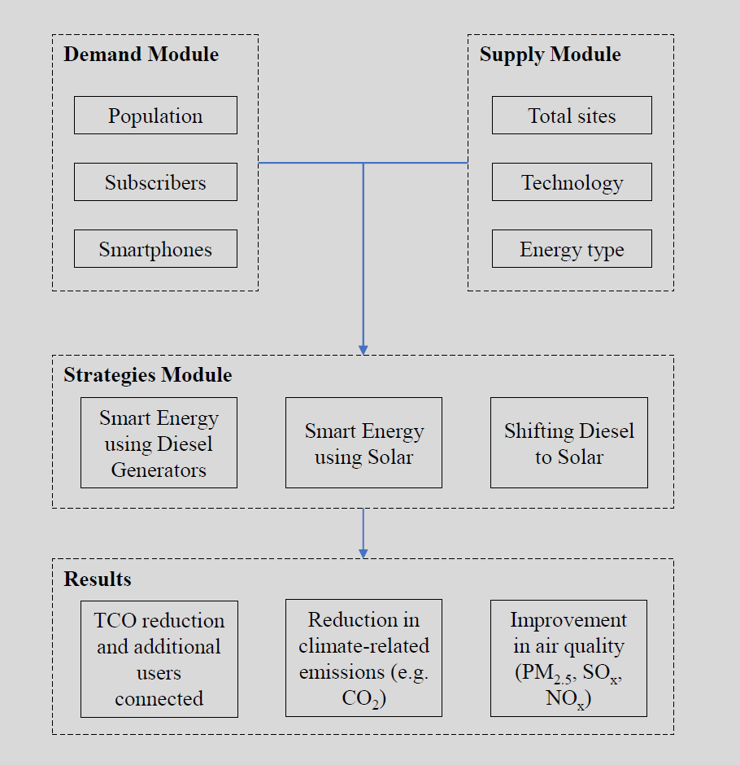

# seismic
Smart Energy Internet Strategies for Mobile Cellular

This codebase quantified the implications of different smart energy internet strategies in
terms of cost-efficiency, and the reduction in both carbon emissions and other air pollutants
(such as NOx, SOx and PM10). The modeling method is illustrated below:

# Method

  </img>

Using conda
==========

The recommended installation method is to use conda, which handles packages and virtual
environments, along with the conda-forge channel which has a host of pre-built libraries and
packages.

Create a conda environment called seismic:

    conda create --name seismic python=3.7 gdal

Activate it (run this each time you switch projects):

    conda activate seismic

First, install required packages for preprocessing and running:

    conda install geopandas rasterio rasterstats

Secondly, install optional packages for data visualization:

    conda install matplotlib seaborn contextily descartes

Background and funding
======================

**seismic** is being developed by researchers at George Mason University.

Contributors
============
- Edward J. Oughton (George Mason University/Oxford)
